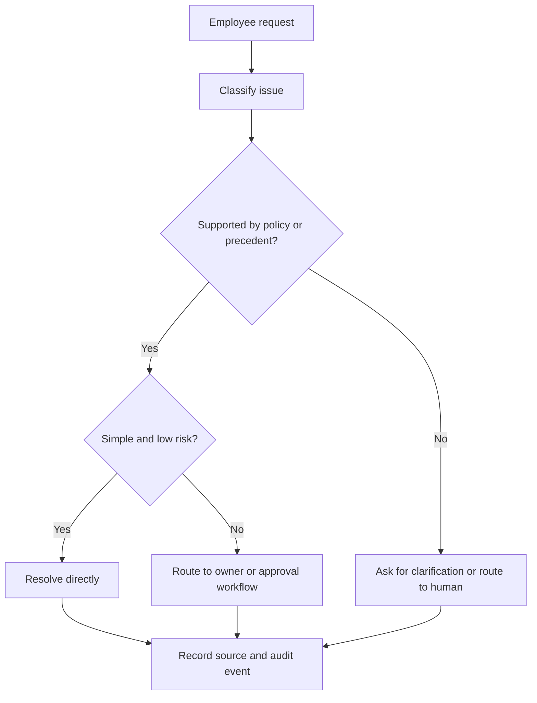

<div align="center">

# Veridian Service Desk

### A policy-grounded internal IT support agent for Veridian Corp.

<p>
	
	
	
</p>

<p>
	Triage employee issues, find the right source, resolve routine requests,<br/>
	route risky cases, and keep a transparent decision history.
</p>

</div>

---

## Overview

Veridian Service Desk is a front-end prototype for **Assignment 2: Internal Service Agent**. It demonstrates an internal IT support workflow using only the supplied Veridian data pack:

- 10 knowledge-base and policy sources
- 15 employee requests
- 10 existing ticket records

The agent is intentionally conservative. It resolves issues only when the source data supports a clear action. When a request needs approval, security review, missing context, or human judgment, it makes that visible and routes the case instead of inventing a policy.

> **Scope note:** This is a reviewable prototype, not a production ITSM system. Data is stored in the browser session and there is no live authentication, ticketing backend, email integration, or external data source.

## What The Agent Demonstrates

| Capability                 | How it appears in the prototype                                                                                   |
| :------------------------- | :---------------------------------------------------------------------------------------------------------------- |
| Understand the issue       | Employee requests are shown with identity, date, issue text, and current state.                                   |
| Find the relevant policy   | Every recommendation displays its supporting `KB-*` source or ticket precedent.                                   |
| Ask follow-up questions    | Unclear requests can be held for clarification instead of receiving an unsafe answer.                             |
| Resolve simple requests    | Routine cases such as guest Wi-Fi, password lockout, VPN renewal, and mailbox guidance can be marked resolved.    |
| Escalate risky requests    | Security incidents, access requests, hardware decisions, and approval-dependent work are routed to a human owner. |
| Create a structured ticket | The intake form captures employee email and issue description, then records an agent-triage event.                |
| Maintain an audit trail    | Actions, source references, follow-ups, and new intake events appear in the audit log and can be exported.        |

## Product Walkthrough

### 1. Overview dashboard

The command centre surfaces request volume, cases needing human routing, direct resolutions, verified sources, and the live workstream.

### 2. Agent inbox

Review all 15 supplied requests with filters for **All**, **Route**, and **Resolve**. Selecting a request opens:

- The original employee request
- A recommended next action
- A visible status such as `Resolve directly`, `Route to human`, or `Awaiting Security`
- The exact grounding source
- Action buttons for resolution or follow-up

### 3. Ticket queue

The existing ticket system is represented separately from employee requests. All 10 supplied tickets remain visible, including closed history and active cases such as pending Security, Finance, or fulfillment work.

### 4. Policy library

The supplied policy sources are presented as reference cards, including password reset, VPN access, laptop replacement, software installation, printer troubleshooting, mailbox quota, guest Wi-Fi, expense access, security reporting, home-office equipment, and the Asset Management extract.

### 5. Audit trail

The audit view records agent decisions with timestamps and source labels. The log can be downloaded as a plain-text file for review.

## Decision Model



The interface makes the reasoning inspectable rather than presenting a black-box answer. For example:

- **REQ-03:** Six failed password attempts meet `KB-01`, so the agent recommends manual unlock with no approval.
- **REQ-08:** The suspected phishing email is routed using `KB-09`, including the instruction not to forward it to colleagues.
- **REQ-11:** Contractor VPN access is routed for manager approval using `KB-02`.
- **REQ-15:** The vague “it’s not working” request is held for clarification because the affected service and error are unknown.

## Data And Grounding

The source records are embedded in [`src/app.js`](src/app.js):

| Dataset           |                                  Records | Purpose                                                   |
| :---------------- | ---------------------------------------: | :-------------------------------------------------------- |
| Knowledge base    | 10 KB entries + Asset Management extract | Determines supported actions and escalation boundaries.   |
| Employee requests |                                       15 | Drives the inbox and request-detail workflow.             |
| Existing tickets  |                                       10 | Provides active/closed context and resolution precedents. |
| Audit events      |                           Session events | Shows what the agent decided and which source it used.    |

The prototype does not claim information outside the assignment data pack. Missing business justification, missing device details, and unknown request intent are treated as reasons to ask or escalate.

## Interface Structure

```text
src/
├── index.html   Application structure and views
├── styles.css   Responsive visual system and layout
└── app.js       Source data, decision copy, interactions, and audit state
```

### Visual direction

- Deep navy operations shell for a focused internal-tool feel
- Teal for grounded, direct-resolution actions
- Amber for approval or waiting states
- Red for security and human-escalation states
- Dense, scannable panels designed for repeated support work
- Responsive layout for desktop and smaller review screens

## Run Locally

No package manager, build command, or environment variables are required.

### Option 1: Open directly

Open [`src/index.html`](src/index.html) in a browser.

### Option 2: Serve locally

From the project root:

```bash
python -m http.server 8000 --directory src
```

Then open:

```text
http://localhost:8000
```

## Review Checklist

1. Open the Overview and inspect the live workstream.
2. Open **Agent inbox** and select `REQ-03` to see a `KB-01` citation.
3. Select `REQ-08` to review the phishing escalation and `KB-09` warning.
4. Select `REQ-15` to see how an unclear request is held for clarification.
5. Use **Ticket queue** to inspect all 10 existing records and their active/closed state.
6. Use **Policy library** to inspect the complete source set.
7. Use **New request** or **Create ticket**, submit a test case, and confirm it appears in the audit trail.
8. Export the audit log from **Audit trail**.

## Assignment Coverage

This prototype is designed to satisfy the requested internal-service-agent behaviors:

- Understand the employee's issue
- Find the relevant policy or resolution
- Ask sensible follow-up questions
- Resolve simple requests
- Escalate risky or unclear requests
- Create a structured ticket
- Show the source used for each answer
- Maintain an audit trail

## Technology

| Layer       | Choice                                                             |
| :---------- | :----------------------------------------------------------------- |
| Markup      | HTML5                                                              |
| Styling     | CSS3 with responsive media queries                                 |
| Interaction | Vanilla JavaScript                                                 |
| Data        | Explicit in-browser JavaScript records from the supplied data pack |
| Runtime     | Any modern browser                                                 |

## Limitations And Next Steps

For a production implementation, the next layer would add authenticated employee identity, persistent ticket storage, role-based approval routing, real ITSM integration, server-side audit retention, and policy versioning. Those capabilities are deliberately outside this zero-install assignment prototype.

<div align="center">

---

**Veridian Corp · Internal IT Support · Assignment 2**

</div>
